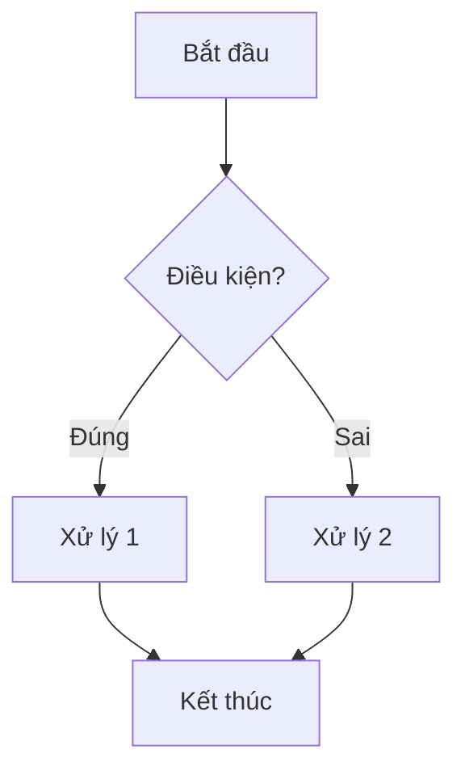
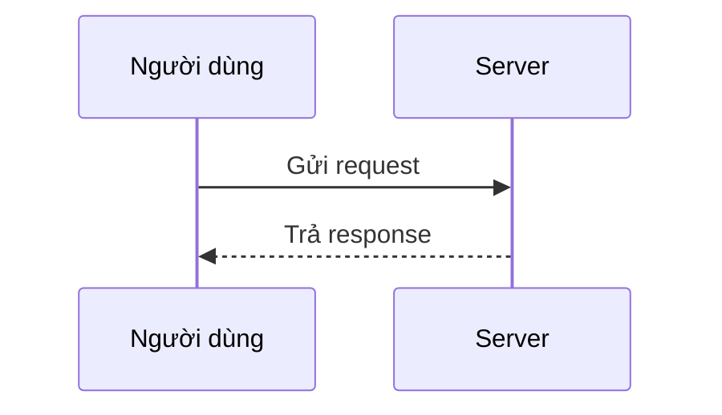

## TL;DR

- Công thức: `$...$` cho **inline**, `$$...$$` cho **khối riêng**. Cú pháp bên trong là **LaTeX**.
- Sơ đồ: code block với ngôn ngữ `mermaid`.
- Các cú pháp này **không thuộc Markdown chuẩn**, có render được hay không tuỳ nền tảng (xem phần 1).
- Cú pháp cơ bản (heading, list, bảng...) nằm ở note [Markdown cheatsheet: cú pháp cơ bản](/posts/markdown-cheatsheet/).

## 1. Nền tảng nào render được

| Nền tảng | Math (`$`, `$$`) | Mermaid | Callout |
| --- | --- | --- | --- |
| GitHub (README, issue, wiki) | Có | Có | Có (dạng Alerts) |
| Obsidian | Có | Có | Có (dạng riêng) |
| Static site (Astro, Hugo, Jekyll...) | Cần cấu hình thêm | Cần cấu hình thêm | Cần cấu hình thêm |

Với static site, thường phải thêm plugin hoặc thư viện (ví dụ KaTeX hoặc MathJax cho math, thư viện Mermaid cho sơ đồ). Nếu chưa cấu hình, nội dung sẽ hiện nguyên dạng text thô. Hãy kiểm tra tài liệu của theme hoặc framework đang dùng, vì hỗ trợ này thay đổi theo từng phiên bản.

## 2. Math (LaTeX)

### 2.1. Inline và block

| Loại | Cú pháp | Kết quả |
| --- | --- | --- |
| Inline (cùng dòng với text) | `$E = mc^2$` | $E = mc^2$ |
| Block (nằm riêng, căn giữa) | `$$ \int_0^1 x^2 \, dx $$` | xem bên dưới |

$$
\int_0^1 x^2 \, dx = \frac{1}{3}
$$

Lưu ý:

- Một số renderer (Obsidian, Pandoc) yêu cầu **không có khoảng trắng** ngay sau `$` mở và ngay trước `$` đóng trong inline math.
- Muốn hiển thị ký tự `$` thường (ví dụ giá tiền) ngoài công thức, escape bằng `\$`.

### 2.2. Phân số, mũ, chỉ số, căn

| Mục đích | Cú pháp | Kết quả |
| --- | --- | --- |
| Phân số | `\frac{a}{b}` | $\frac{a}{b}$ |
| Số mũ | `x^2` | $x^2$ |
| Chỉ số dưới | `x_i` | $x_i$ |
| Mũ hoặc chỉ số nhiều ký tự | `x^{10}`, `x_{ij}` | $x^{10}$, $x_{ij}$ |
| Căn bậc hai | `\sqrt{x}` | $\sqrt{x}$ |
| Căn bậc n | `\sqrt[3]{x}` | $\sqrt[3]{x}$ |

Quy tắc: bất kỳ phần nào gồm **nhiều hơn 1 ký tự** thì phải bọc trong `{ }`, nếu không LaTeX chỉ lấy ký tự đầu tiên.

### 2.3. Chữ thường trong công thức

Dùng `\text{...}` để chữ không bị in nghiêng và dính liền như biến toán học:

```latex
\text{Diện tích} = \text{dài} \times \text{rộng}
```

$$
\text{Diện tích} = \text{dài} \times \text{rộng}
$$

### 2.4. Toán tử và quan hệ

| Ký hiệu | Cú pháp | Kết quả |
| --- | --- | --- |
| Nhân, chia | `\times`, `\cdot`, `\div` | $\times$, $\cdot$, $\div$ |
| Cộng trừ | `\pm` | $\pm$ |
| So sánh | `\leq`, `\geq`, `\neq` | $\leq$, $\geq$, $\neq$ |
| Xấp xỉ | `\approx` | $\approx$ |
| Mũi tên | `\rightarrow`, `\Rightarrow`, `\leftrightarrow` | $\rightarrow$, $\Rightarrow$, $\leftrightarrow$ |
| Mũi tên lên, xuống | `\uparrow`, `\downarrow` | $\uparrow$, $\downarrow$ |
| Vô cực | `\infty` | $\infty$ |

### 2.5. Chữ cái Hy Lạp

| Cú pháp | Kết quả | Cú pháp | Kết quả |
| --- | --- | --- | --- |
| `\alpha` | $\alpha$ | `\mu` | $\mu$ |
| `\beta` | $\beta$ | `\sigma` | $\sigma$ |
| `\gamma` | $\gamma$ | `\theta` | $\theta$ |
| `\delta` | $\delta$ | `\pi` | $\pi$ |
| `\Delta` (chữ hoa) | $\Delta$ | `\Sigma` (chữ hoa) | $\Sigma$ |

Chữ hoa viết hoa chữ cái đầu của lệnh (`\delta` → `\Delta`).

### 2.6. Tổng, tích phân, giới hạn

| Mục đích | Cú pháp | Kết quả |
| --- | --- | --- |
| Tổng | `\sum_{i=1}^{n} x_i` | $\sum_{i=1}^{n} x_i$ |
| Tích | `\prod_{i=1}^{n} x_i` | $\prod_{i=1}^{n} x_i$ |
| Tích phân | `\int_a^b f(x)\,dx` | $\int_a^b f(x)\,dx$ |
| Giới hạn | `\lim_{x \to 0} \frac{\sin x}{x}` | $\lim_{x \to 0} \frac{\sin x}{x}$ |

Khoảng cách nhỏ `\,` đặt trước `dx` để `dx` không dính vào hàm.

### 2.7. Ngoặc tự co giãn, ma trận, hệ phương trình

```latex
\left( \frac{a}{b} \right)
```

$$
\left( \frac{a}{b} \right)
$$

```latex
\begin{pmatrix}
a & b \\
c & d
\end{pmatrix}
```

$$
\begin{pmatrix}
a & b \\
c & d
\end{pmatrix}
$$

```latex
f(x) =
\begin{cases}
x^2 & \text{nếu } x \geq 0 \\
-x  & \text{nếu } x < 0
\end{cases}
```

$$
f(x) =
\begin{cases}
x^2 & \text{nếu } x \geq 0 \\
-x  & \text{nếu } x < 0
\end{cases}
$$

Quy tắc chung của môi trường nhiều dòng: `&` để căn cột, `\\` để xuống dòng.

### 2.8. Nhiều dòng thẳng hàng

Dùng `aligned` và đặt `&` ngay trước dấu `=` để các dấu `=` thẳng hàng:

```latex
\begin{aligned}
(a+b)^2 &= a^2 + 2ab + b^2 \\
        &= a^2 + b^2 + 2ab
\end{aligned}
```

$$
\begin{aligned}
(a+b)^2 &= a^2 + 2ab + b^2 \\
        &= a^2 + b^2 + 2ab
\end{aligned}
$$

Muốn giãn cách giữa 2 dòng, thêm khoảng cách sau `\\`, ví dụ `\\[1.5em]`.

### 2.9. Ký tự đặc biệt cần escape trong công thức

| Ký tự | Cú pháp | Kết quả |
| --- | --- | --- |
| `&` | `\&` | $\&$ |
| `$` | `\$` | $\$$ |
| `%` | `\%` | $\%$ |
| `#` | `\#` | $\#$ |
| `_` | `\_` | $\_$ |
| `{` và `}` | `\{` và `\}` | $\{ \}$ |

## 3. Sơ đồ bằng Mermaid

Viết trong code block với ngôn ngữ `mermaid`:

````markdown

````

### 3.1. Flowchart

| Thành phần | Cú pháp |
| --- | --- |
| Hướng sơ đồ | `flowchart TD` (trên xuống), `LR` (trái sang phải) |
| Hình chữ nhật | `A[Nhãn]` |
| Bo tròn | `A(Nhãn)` |
| Hình thoi (điều kiện) | `A{Nhãn}` |
| Mũi tên | `A --> B` |
| Mũi tên có nhãn | `A -->\|nhãn\| B` hoặc `A -- nhãn --> B` |
| Đường nét đứt | `A -.-> B` |
| Nhóm | `subgraph Tên` ... `end` |

### 3.2. Sequence diagram

````markdown

````

- `->>` là mũi tên liền, `-->>` là mũi tên nét đứt (thường dùng cho response).

### 3.3. Các loại sơ đồ khác

| Từ khoá | Dùng cho |
| --- | --- |
| `classDiagram` | Sơ đồ class |
| `stateDiagram-v2` | Sơ đồ trạng thái |
| `erDiagram` | Quan hệ thực thể (database) |
| `gantt` | Lịch tiến độ |
| `pie` | Biểu đồ tròn |

### 3.4. Lưu ý khi viết nhãn

Nhãn có ký tự đặc biệt như `( )`, `[ ]`, dấu hai chấm hoặc chữ có dấu phức tạp nên bọc trong dấu nháy kép để tránh lỗi cú pháp:

```text
A["Bước 1: nhập dữ liệu (tuỳ chọn)"]
```

## 4. Callout

### 4.1. GitHub Alerts

```markdown
> [!NOTE]
> Thông tin bổ sung hữu ích.

> [!TIP]
> Mẹo giúp làm tốt hơn.

> [!IMPORTANT]
> Thông tin quan trọng cần biết.

> [!WARNING]
> Cảnh báo về rủi ro.

> [!CAUTION]
> Hành động có thể gây hậu quả nghiêm trọng.
```

### 4.2. Obsidian callout

```markdown
> [!note] Tiêu đề tuỳ chọn
> Nội dung callout.

> [!tip]- Callout thu gọn mặc định
> Dấu `-` sau loại callout để thu gọn, dấu `+` để mở sẵn.
```

Hai dạng trên có cú pháp gần giống nhau nhưng **không hoàn toàn tương thích**: GitHub chỉ nhận 5 loại cố định và không hỗ trợ tiêu đề riêng hay thu gọn.

## 5. Mẹo HTML

### 5.1. Căn giữa bảng

Bọc bảng bằng thẻ `<div align="center">` và **chừa dòng trống** sau thẻ mở và trước thẻ đóng:

````markdown
<div align="center">

| Cột 1 | Cột 2 |
| :---: | :---: |
| A     | B     |

</div>
````

Thuộc tính `align` đã lỗi thời trong HTML nhưng vẫn được GitHub hỗ trợ. Trên site riêng, căn giữa bằng CSS sẽ bền hơn.

### 5.2. Tạo khoảng trống giữa các đoạn

- Dòng trống hoàn toàn: để **1 dòng trống** giữa hai đoạn (đây là cách chuẩn).
- Muốn khoảng cách lớn hơn: chèn thẻ `<br>` giữa hai đoạn.
- Trong khối math: dùng `\\[1.5em]` như phần 2.8.

## 6. Lỗi thường gặp

| Triệu chứng | Nguyên nhân | Cách xử lý |
| --- | --- | --- |
| Công thức hiện nguyên text `$...$` | Nền tảng hoặc site chưa bật render math | Bật plugin math hoặc kiểm tra bảng ở phần 1 |
| Inline math không nhận | Có khoảng trắng ngay sau `$` mở hoặc trước `$` đóng | Bỏ khoảng trắng đó |
| Mũ hoặc chỉ số chỉ ăn ký tự đầu | Thiếu `{ }` khi có nhiều ký tự | Viết `x^{10}` thay vì `x^10` |
| Tiền tệ `$100` bị hiểu là công thức | `$` không được escape | Viết `\$100` |
| Mermaid báo lỗi cú pháp | Nhãn chứa ký tự đặc biệt chưa bọc nháy kép | Bọc nhãn trong `"..."` |
| Mermaid hiện thành code block thường | Nền tảng chưa hỗ trợ hoặc chưa cấu hình | Kiểm tra bảng ở phần 1 |
| Callout hiện thành quote thường | Nền tảng không hỗ trợ cú pháp callout đó | Dùng đúng dạng mà nền tảng hỗ trợ |

## Kết luận

Math, Mermaid và callout đều là phần **mở rộng**, nên trước khi dùng hãy xác nhận nền tảng đích có render được. Với công thức, 3 điều cần nhớ là `$` cho inline, `$$` cho block và `{ }` cho mọi thứ nhiều hơn 1 ký tự.
